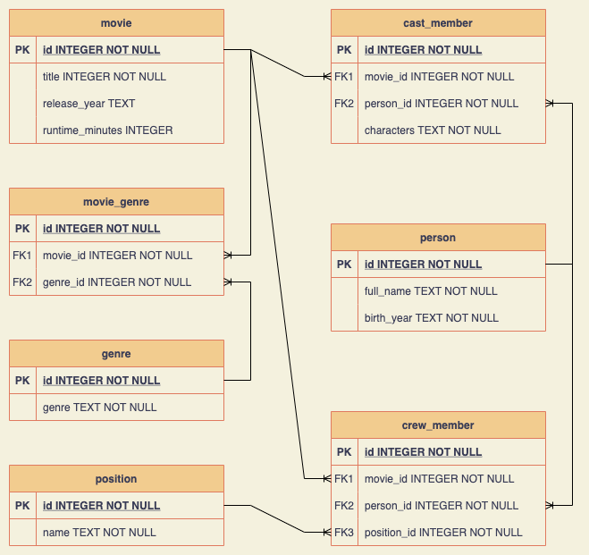

# MovieDB

A movie database API.

Data from [IMDB](https://www.imdb.com/interfaces/).

-   title.basics.tsv
-   name.basics.tsv
-   title.principals.tsv
-   title.ratings.tsv

Top 1000 rated movies with 1000+ votes.

### To seed data

```
npm run seed
```

#### Relational Diagram


